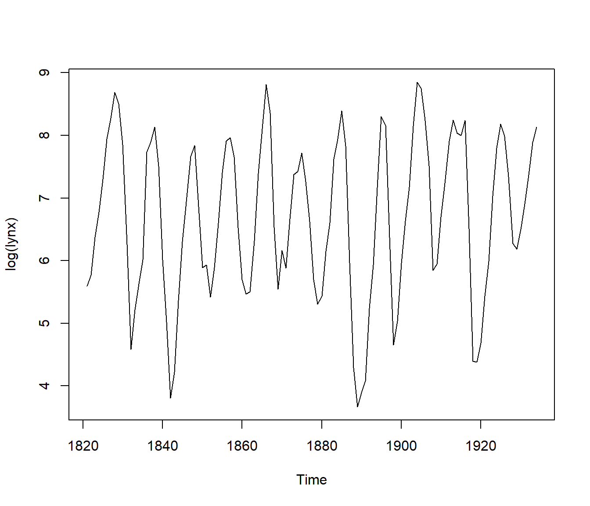
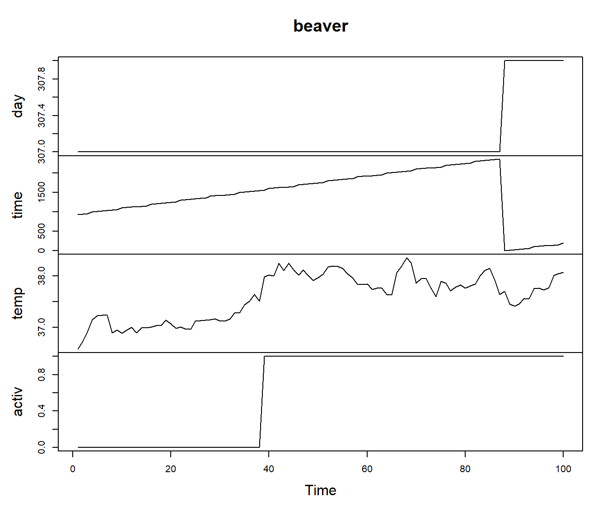
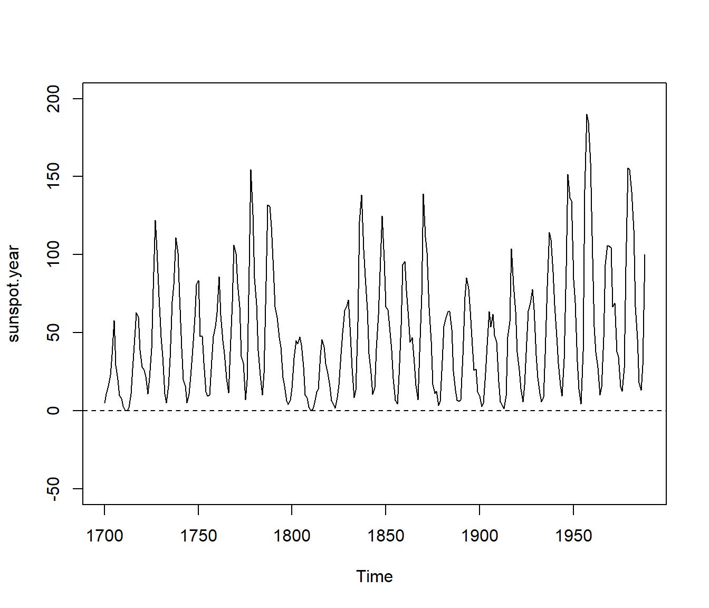
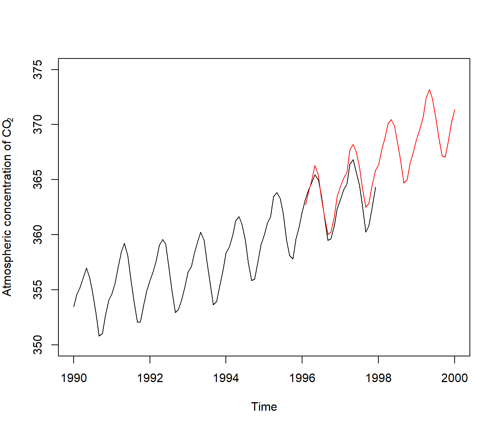
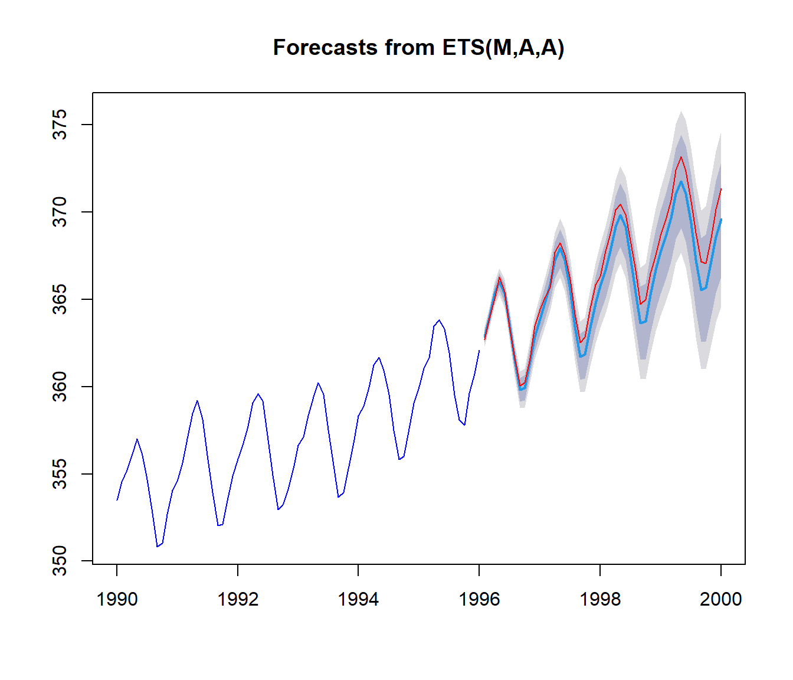

# El Bootstrap con datos dependientes {#bootdep}


En este capítulo se presentan gran cantidad de métodos bootstrap para
realizar inferencia, así como predicción, en el contexto de datos
dependientes. En primer lugar se hace una introducción a las condiciones
habituales de dependencia y a los modelo paramétricos de dependencia,
para luego centrarse en los métodos de remuestreo en ambos contextos.

En cada uno de los dos contextos (estimación y predicción) se estudiarán
dos situaciones drásticamente diferentes. En la primera de ellas
consideraremos modelos en los que la estructura de dependencia está
explícitamente modelizada (normalmente a través de una ecuación de
autorregresión), mientras que la segunda trata el caso en que no existe
ninguna especificación explícita de la estructura de dependencia
(simplemente se asumen condiciones mixing, por ejemplo). Una revisión
sobre los resultados principales puede verse en Cao (1999).

## Introducción a las condiciones de dependencia y modelos habituales de datos dependientes

### Situaciones de dependencia general

Consideramos un proceso estocástico en tiempo discreto y con espacio de
estados continuo (p. ej. $\mathbb{R}$), $\left\{X_{t}\right\}_{t\in \mathbb{Z}}$, 
del cual observamos parte de su trayectoria: $\left( X_1,X_2,\ldots ,X_n \right)$, 
es decir una muestra de datos dependientes. 
Este tipo de procesos estocásticos suelen llamarse series temporales.

Normalmente supondremos que el proceso
$\left\{ X_{t}\right\}_{t\in \mathbb{Z}}$ es estacionario. 
En ocasiones se requerirá además que sea fuertemente mixing:
$$\sup_{A\in \mathcal{F}_1^{n},B\in \mathcal{F}_{n+k}^{\infty }}\left\vert
P\left( A\cap B \right) -P\left( A \right) P(B) \right\vert \leq
\alpha _{k}\text{, con }\alpha _{k}\rightarrow 0,$$
o bien uniformemente mixing:
$$\left\vert P\left( A\cap B \right) -P\left( A \right) P(B) \right\vert 
\leq \phi _{k}P\left( A \right) \text{, }\forall A\in \mathcal{F}_1^{n},
\forall B\in \mathcal{F}_{n+k}^{\infty }\text{, con }\phi_{k}\rightarrow 0,$$
siendo $\mathcal{F}_{s}^{t}$ la $\sigma$-algebra generada por las variables aleatorias
$X_{s},\ldots ,X_{t}$.

Estas condiciones establecen que la dependencia entre las variables
aleatorias que conforman las observaciones de la muestra se atenúa a
medida que sus instantes temporales se distancian.

### Modelos paramétricos de dependencia

Los modelos paramétricos más habituales para datos dependientes y
estacionarios son los autorregresivos ($AR\left( p \right)$):
$$X_{t}=\phi _1X_{t-1}+\phi _2X_{t-2}+\cdots +\phi _{p}X_{t-p}+a_{t}
\text{, }t\in \mathbb{Z},$$
de medias móviles ($MA\left( q \right)$):
$$X_{t}=a_{t}-\theta _1a_{t-1}-\theta _2a_{t-2}-\cdots -\theta _{p}a_{t-q}
\text{, }t\in \mathbb{Z}$$
y la mezcla de ambos ($ARMA\left( p,q \right)$):
$$\begin{aligned}
X_{t} =&\ \phi _1X_{t-1}+\phi _2X_{t-2}+\cdots +\phi _{p}X_{t-p} \\
&+a_{t}-\theta _1a_{t-1}-\theta _2a_{t-2}-\cdots -\theta _{q}a_{t-q},\end{aligned}$$
En las anteriores expresiones los
$\left\{ a_{t}\right\} _{t\in \mathbb{Z}}$ representan una sucesión de
variables independientes con la misma distribución (ruido blanco),
habitualmente con distribución normal.


## El bootstrap en la estimación con datos dependientes

El objetivo de esta sección es mostrar distintos métodos de remuestreo
para realizar inferencia sobre los parámetros de una serie temporal.
Comenzaremos tratando los modelos de dependencia explícita para luego
abordar la situación en que tan sólo existen condiciones generales de
dependencia.

### Modelos paramétricos de dependencia

Consideremos uno de los casos más simples, dado por el modelo $AR(p)$:
$$X_{t}=\phi _1X_{t-1}+\phi _2X_{t-2}+\cdots +\phi _{p}X_{t-p}+a_{t},$$donde
$\{a_{t}\}$ es una sucesión de variables aleatorias independientes de
media cero (ruido blanco), de tal forma que $a_{t}$ es independiente del
pasado de $X_{t}$: $\{X_{t-1},X_{t-2},\ldots \}$.

En el contexto de estimación error cuadrático medio de predicción
(PMSE), Stine (1987) propone un método bootstrap que mejora el estimador
clásico de sustitución del PMSE del mejor predictor lineal estimado (ver
capítulo 2 de Fuller (1976)), cuando la distribución del ruido blanco no
tiene porqué ser normal. El método procede como sigue:

1.  Obtener una estimación de los coeficientes de autorregresión:
    $$\widehat{\phi}_1,\widehat{\phi}_2,\ldots ,\widehat{\phi}_{p}.$$En
    el artículo de Stine estos estimadores se obtienen por el método de
    mínimos cuadrados.

2.  Calcular los residuos (para aquellos índices que sea posible):
    $$\widehat{a}_{t}=X_{t}-\widehat{\phi}_1X_{t-1}-\widehat{\phi}
    _2X_{t-2}+\cdots -\widehat{\phi}_{p}X_{t-p},\quad t=p+1,p+2,\ldots ,n.$$
    Estos valores son sustitutos de los errores inobservables $a_{t}$.

3.  Calcular la distribución empírica de los residuos corregidos
    (recentrados y reescalados):
    $$F_n^{\widehat{a}}(x)=\frac{1}{n-p}\sum_{t=p+1}^{n}1_{\{\widehat{a}_{t}^{\prime}\leq x\}},$$
    donde $\widehat{a}_{t}^{\prime}=\widehat{a}_{t}-\bar{a}$ y
    $\bar{a}=\frac{1}{n-p}\sum_{t=p+1}^{n}\widehat{a}_{t}$.

4.  Arrojar $a_{t}^{\ast}$, $t=1,2,\ldots ,n+k$ observaciones iid con
    distribución $F_n^{\widehat{a}}$.

5.  Fijar los primeros $p$ valores de las réplicas bootstrap de la serie:
    $$X_1^{\ast},X_2^{\ast},\ldots ,X_{p}^{\ast}$$ 
    igual a cero (o con igual probabilidad de los $n-p+1$ bloques posibles 
    de observaciones consecutivas de la serie original) y definir:
    $$X_{t}^{\ast}=\widehat{\phi}_1X_{t-1}^{\ast}+\widehat{\phi}_2
    X_{t-2}^{\ast}+\cdots +\widehat{\phi}_{p}X_{t-p}^{\ast}+a_{t}^{\ast},
    \quad t=p+1,\ldots ,n+k.$$

6.  A partir de la remuestra bootstrap (hasta el instante $n$), calcular
    las versiones bootstrap,
    $\widehat{\phi}_1^{\ast},\widehat{\phi}
    _2^{\ast},\ldots ,\widehat{\phi}_{p}^{\ast}$, de los
    estimadores y obtener $\widehat{X}_{n+k}^{\ast}$, la predicción de
    $X_{n+k}^{\ast}$, usando la versión bootstrap de los estimadores de
    los parámetros y las últimas observaciones de la remuestra
    bootstrap.

7.  Aproximar el PMSE mediante su análogo bootstrap:
    $$PMSE^{\ast}=E^{\ast}\left[ \left( \widehat{X}_{n+k}^{\ast}-X_{n+k}^{\ast
    } \right)^2\right] .$$

Ferretti y Romo (1996) demuestran la consistencia de un bootstrap basado
en los residuos (en el sentido de convergencia débil de la distribución
bootstrap) para contrastes de raíz unitaria en series temporales del
tipo $AR(1)$, tanto en el caso de errores iid como cuando el error sigue
también un modelo $AR(1)$. Heimann y Kreiss (1996) dan un resultado
similar, sólo para el caso de errores iid, cuando el tamaño muestral de
las remuestras bootstrap es $m_n$, de forma que $\frac{m_n}{n}
\rightarrow 0$ (subremuestreo).

Las ideas generales sobre el bootstrap para modelos autorregresivos
pueden extenderse al bootstrap de series temporales autorregresivas y de
media móvil. Consideremos un modelo $ARMA(p,q)$: $$\begin{aligned}
X_{t} =&\ \phi _1X_{t-1}+\phi _2X_{t-2}+\cdots +\phi _{p}X_{t-p} \\
&+a_{t}-\theta _1a_{t-1}-\theta _2a_{t-2}-\cdots -\theta _{q}a_{t-q},\end{aligned}$$o,
equivalentemente,
$$\phi (B)X_{t}=\theta (B)a_{t},$$
donde 
$$\phi (B)=1-\phi _1B-\phi _2B^2-\cdots -\phi _{p}B^{p}\\ 
\theta(B)=1-\theta _1B-\theta _2B^2-\cdots -\theta _{q}B^{q}$$ 
y $B$ es el operador retardo: $BX_{t}=X_{t-1}$. 
La diferencia principal con
respecto al caso autorregresivo es que ahora se necesitan estimar los
coeficientes la parte de media móvil, al objeto de calcular los
residuos, $\widehat{a}_{t}$. 
Así, el algoritmo bootstrap para una serie $AR(p)$ puede
adaptarse a este caso de manera inmediata. 
En este contexto, Kreiss y Franke (1992) usan la representación  
$MA(\infty )$ del proceso de error en términos de la series original,
$$a_{t}=\theta (B)^{-1}\phi(B) X_{t},$$ 
para construir los residuos 
(utilizando los parámetros estimados en la fórmula anterior) y demuestran 
la validez asintótica del bootstrap (en el sentido de la distancia de Mallows) 
para aproximar la distribución en el muestreo del $M$-estimador de los
parámetros de un modelo $ARMA(p,q)$.

Paparoditis (1996) demuestra la validez del bootstrap para la inferencia
acerca de los parámetros de un proceso $ARMA$ multidimensional de orden
infinito. El autor propone arrojar réplicas bootstrap de modelos $ARMA$
de orden finito creciente, de forma que ese orden tienda a infinito a
cierta tasa, según crece el tamaño muestral. Bühlmann (1997) desarrolla
ideas semejantes en el contexto de procesos $AR\left( \infty \right)$,
introduciendo el llamado *sieve bootstrap*. Este método se ha extendido
estimación no paramétrica de la regresión cuando la variable explicativa
sigue un modelo $AR\left( \infty \right)$ (ver Bühlmann (1998)).

### Situaciones de dependencia general

En esta sección se estudia el caso en que no se asume ningún tipo de
estructura autorregresiva sobre el proceso estocástico. De hecho,
asumiremos condiciones generales de dependencia, como condiciones mixing
o de $m$-dependencia, por ejemplo.

El problema de no tener una ecuación explícita que relacione el valor
actual de la serie con sus valores pasados provoca que no sea posible
diseñar un plan de remuestreo a partir de un modelo de dependencia
explícita.

### El bootstrap por bloques

La primeras propuestas para evitar el problema de carecer de una
expresión explícita para modelizar la dependencia corresponden a Künsch
(1989) y Liu y Singh (1992), que propusieron de forma independiente el
llamado bootstrap por bloques (moving blocks bootstrap o MBB). El método
procede del siguiente modo:

1.  Fijar un entero positivo, $b$, el tamaño del bloque, y tomar $k$
    igual al menor entero mayor o igual que $\frac{n}{b}$.

2.  Definir los bloques (o submuestras): $B_{i,b}=(X_i,X_{i+1},\ldots
    ,X_{i+b-1})$, o simplemente $B_i$, para $i=1,2,\ldots ,q$
    ($q=n-b+1$)$.$

3.  Arrojar $k$ observaciones (bloques), $\xi _1,\xi _2,\ldots ,\xi
    _{k}$, con distribución equiprobable sobre el conjunto de posibles
    bloques: $\{B_1,B_2,\ldots ,B_{q}\}$. Cada $\xi _i$ es un
    vector $b$-dimensional $(\xi _{i,1},\xi _{i,2},\ldots ,\xi _{i,b})$.

4.  Definir $\vec{X}^{\ast}$ como el vector formado por las $n$
    primeras componentes de
    $$(\xi _{1,1},\xi _{1,2},\ldots ,\xi _{1,b},\xi _{2,1},\xi _{2,2},\ldots ,\xi
    _{2,b},\ldots ,\xi _{k,1},\xi _{k,2},\ldots ,\xi _{k,b}).$$

Si tomamos $b=1$, entonces $k=n$ y se obtiene el bootstrap ordinario.
Por otra parte, si $b=n$, tenemos $k=1$ y se obtiene el remuestreo
degenerado, ya que todas las réplicas bootstrap coincidirían con la
muestra original.

Künsch (1989) y Liu y Singh (1992) demuestran la validez asintótica de
este método bajo condiciones poco restrictivas sobre el grado de
dependencia y el tamaño del bloque. Por ejemplo, Liu y Singh (1992)
demuestran que si el proceso estocástico es $m$-dependiente (i.e.,
$(X_{t},X_{t+1},\ldots )$ y $(X_{s},X_{s-1},\ldots )$ son independientes
siempre que $s+m<t$), si $T$ es un funcional dos veces Frechet
diferenciable y el tamaño del bloque satisface $b\rightarrow \infty$ y
$b\log
n/n\rightarrow 0$, entonces
$$\sup_{x\in \mathbb{R}}\left\vert P^{\ast}\left\{ \sqrt{n}\left(
T(F_n^{\ast})-T\left( F_n \right) \right) \leq x\right\} -P\left\{ \sqrt{
n}\left( T(F_n)-T\left( F \right) \right) \leq x\right\} \right\vert
\rightarrow 0\mathrm{,}$$en probabilidad. Naik-Nimbalkar y Rajarshi
(1994) demuestran la consistencia del proceso empírico MBB bajo la
condición de que $b=O(n^{1/2-\varepsilon })$, para algún
$\varepsilon \in (\frac{1}{4},\frac{1}{2})$. Bühlmann (1994) lo extiende
al caso multivariante y debilita la condición sobre $\varepsilon$,
siendo $\varepsilon \in (0,\frac{1}{2})$.

Carlstein, Do, Hall, Hesterberg y Künsch (1998) propusieron una
modificación del MBB. Su idea consiste en seleccionar las remuestras de
bloques de acuerdo a una cadena de Markov. El primer bloque de la
remuestra bootstrap se genera igual que para el MBB ordinario. Una vez
que se se seleccionado en la remuestra el bloque $B_i$, el siguiente
bloque de la remuestra bootstrap se elige dentro de todos los posibles
bloques, $B_j$, poniendo más probabilidad a aquellos que son
precedidos por un bloque,
$B_{j-1}$, cuyo último valor, $X_{j+b-2}$, es más cercano al último
valor, $X_{i+b-1}$, del bloque $B_i$. En el caso $j=1$, esta regla no
tiene sentido, ya que no existe un bloque anterior al $B_1$, así que,
en ese caso los autores proponen hacer que la probabilidad dependa de la
distancia entre $X_1$ (el primer valor del bloque $B_1$) y el valor
siguiente al último del bloque $B_i$, es decir $X_{i+b}$. De nuevo
esto sólo es posible si $i<q$. Si $i=q$ usan $X_1$ en lugar de
$X_{i+b}$. Estas probabilidades se calculan usando pesos de tipo núcleo.
Estos autores demuestran la consistencia de esta versión del MBB para el
estimador bootstrap de la varianza de la media muestral.

### Elección de $b$

Un asunto importante en el método bootstrap por bloques es la elección
del tamaño del bloque, $b$. Hall, Horowitz y Jing (1995) considera este
problema en el contexto de la estimación bootstrap del sesgo y la
varianza. Obtienen una expresión asintótica para el error cuadrático
medio: 
$$n^{-2}(C_1b^{-2}+C_2n^{-1}b),$$
donde $C_1$ y $C_2$ son
constantes desconocidas que dependen del problema de estimación del que
se trate. Está claro entonces que el tamaño óptimo del bloque (en el
sentido del error cuadrático medio) es de orden $n^{1/3}$.

Un resultado importante de utilidad para probar la validez del MBB en
muchos contextos es el dado por Radulović (1996). Este autor demuestra
que siempre que una sucesión de variables aleatorias fuertemente mixing
satisface el Teorema Central del Límite, dicho resultado también es
válido para la versión bootstrap por bloques.

### El bootstrap estacionario

Consideremos el bootstrap por bloques para una muestra,
$(X_1,X_2,\ldots
,X_n)$, de tamaño $n=100$ y el tamaño del bloque $b=10$. Podemos
calcular fácilmente las distribuciones bootstrap conjuntas de
$(X_{10}^{\ast},X_{11}^{\ast})$ y $(X_{9}^{\ast},X_{10}^{\ast})$:
$$\begin{aligned}
P^{\ast}\left\{ (X_{10}^{\ast},X_{11}^{\ast})=(X_i,X_j)\right\} =
\frac{1}{91^2},\quad \hbox{para}\quad i &= 10,11,\ldots ,100; \\
j &= 1,2,\ldots ,91 \\
P^{\ast}\left\{ (X_{9}^{\ast},X_{10}^{\ast})=(X_i,X_j)\right\} =\frac{
1}{91},\quad \hbox{para}\quad i &= 9,10,\ldots ,99;\,\,j=i+1.\end{aligned}$$Como
estas distribuciones bootstrap son diferentes entonces el MBB no es
estacionario.

Con el fin de remediar la falta de estacionariedad del MBB, Politis y
Romano (1994a) proponen el llamado bootstrap estacionario (stationary
bootstrap, SB). El método necesita de la elección de un número $p\in
\lbrack 0,1]$ y puede presentarse de dos formas equivalentes:

**SB1:**

1.  Arrojar $X_1^{\ast}$ de $F_n$, la distribución empírica
    construida con las muestra $(X_1,X_2,\ldots ,X_n).$

2.  Una vez que se ha arrojado el valor $X_i^{\ast}=X_j$ (para
    algún $j\in \{1,2,\ldots ,n-1\}$) con $i<n$, se define la siguiente
    observación bootstrap, $X_{i+1}^{\ast}$, como $X_{j+1}$, con
    probabilidad $1-p$ y arrojada de la función de distribución empírica
    de la muestra, con probabilidad $p$. En el caso $j=n$, la
    observación $X_{j+1}$ se reemplaza por $X_1$.


**SB2:**

1.  Definir los bloques circulares $B_{i,b}=(X_i,X_{i+1},\ldots
    ,X_{i+b-1})$ con $b\in \mathbb{N}$, $i=1,2,\ldots ,n$ y
    $X_{t}=X_{\left(\left( t-1 \right) \mathrm{mod\ }n \right) +1}$ si $t>n$.

2.  Arrojar realizaciones iid, $L_1,L_2,\ldots$, con distribución
    geométrica de parámetro $p$, i.e.
    $$P(L_1=m)=p(1-p)^{m-1},m=1,2,\ldots$$

3.  Obtener enteros aleatorios, $I_1,I_2,\ldots$, con distribución
    equiprobable sobre el conjunto $\{1,2,\ldots ,n\}$.

4.  Definir $X_1^{\ast},X_2^{\ast},\ldots ,X_n^{\ast}$ como los
    $n$ primeros valores obtenidos al unir los bloques
    $B_{I_1,L_1},B_{I_2,L_2},\ldots$

A continuación se comentan algunos aspectos interesantes en relación con
el SB.

-   El número mínimo de bloques necesario, $k$, en el método de
    remuestreo SB2, de forma que el conjunto de bloques
    $B_{I_1,L_1},B_{I_2,L_2},\ldots ,B_{I_{k},L_{k}}$ tenga, al
    menos, $n$ observaciones, coincide con el menor entero $k$ para el
    cual $\sum_{i=1}^{k}L_i\geq n$.

-   Eligiendo $p=1$ se tiene el bootstrap clásico. La elección
    $p=0$ corresponde a una permutación circular aleatoria de la
    muestra, que conduce a una distribución bootstrap degenerada si el
    estadístico es funcional (i.e., si es sólo función de la
    distribución empírica, pero no depende del orden de los datos).

-   Condicionalmente a la muestra observada, el proceso bootstrap,
    $\{X_i^{\ast}\}$, es estacionario. Más aún, si no hay datos
    empatados, entonces el proceso bootstrap es un proceso de Markov. En
    general, es un proceso markoviano de orden $r+1$, donde
    $$r=\max \left\{ b\in \mathbb{N}\,/\,\,\exists i,j,\,\,i\neq j\quad \hbox{con}
    \quad B_{i,b}=B_{j,b}\right\} .$$

-   Observando el esquema de remuestreo SB2 resulta fácil generalizar el
    método a casos en los que la distribución de $L_i$ no es
    geométrica y la distribución de los $I_i$ no tiene porqué ser
    equiprobable. En tales casos, debe ponerse mucho cuidado en la
    elección de esas distribuciones para no destruir la estacionariedad
    del proceso bootstrap. Con esta generalización del remuestreo SB2,
    el MBB puede pensarse como un caso particular, tomando
    $$\begin{aligned}
    P(L_i &= m)=\left\{ 
    \begin{array}{lll}
    1 & \mathrm{si} & m=b \\ 
    0 & \mathrm{si} & m\neq b
    \end{array}
   \right. \\
    P(I_i &= j)=\left\{ 
    \begin{array}{lll}
    1/q & \mathrm{si} & j=1,2,\ldots ,q \\ 
    0 & \mathrm{si} & j=q+1,q+2,\ldots ,n
    \end{array}
   \right. \\
    \quad \hbox{con}\quad q&= n-b+1.\end{aligned}$$

-   Como el tamaño medio del bloque en el SB es $\frac{1}{p}$, en cierto
    sentido el valor $p$ juega el papel inverso del tamaño del bloque en
    el MBB ($p=1$ es comparable con $b=1$ y $p=0$ con
    $b\rightarrow \infty$).

Dado un proceso estocástico estrictamente estacionario con función de
autocovarianza $\gamma$, cumpliendo $\gamma (0)+\sum_{r}\left\vert
r\gamma (r)\right\vert <\infty ,$ con momento finito de orden $d+2$
(para algún $d>0$) y la siguiente condición para los coeficientes
mixing: $$\sum_{k}\alpha _{k}^{\frac{d}{d+2}}<\infty ,$$Politis y Romano
(1994a) demostraron la validez asintótica del bootstrap estacionario:
$$\sup_{x\in \mathbb{R}}\left\vert P^{\ast}\left\{ \sqrt{n}(\bar{X}_n^{\ast
}-\bar{X}_n)\leq x\right\} -P\left\{ \sqrt{n}(\bar{X}_n-\mu )\leq
x\right\} \right\vert \rightarrow 0,$$en probabilidad, siempre que
$p\rightarrow 0$ y $np\rightarrow \infty$. Estos autores también dan
una idea acerca de cómo generalizar este resultado a estadísticos
funcionales, $T(F_n)$, donde $T$ es un funcional Frechet
diferenciable. Politis y Romano (1994c) también demostraron que el
método funciona para una amplia clase de estimadores, incluyendo los de
mínima distancia.

### El método del submuestreo

Politis y Romano (1994b) proporcionan un método bootstrap que es válido
bajo condiciones minimales. Estos autores presentan dos versiones de
este método: una para datos independientes y otra para datos
dependientes.

Para enunciar el método del submuestreo de forma unificada consideremos
las observaciones, $X_1,X_2,\ldots ,X_n$, que provienen o bien de
(a) variables aleatorias iid con distribución $F$ o (b) un proceso
estocástico fuertemente mixing. Consideremos un parámetro
$\theta =\theta (F)$, $T_n=T_n(X_1,X_2,\ldots ,X_n)$ un
estimador de él, y $J_n(\cdot ,F)$ la función de distribución en el
muestreo de $\tau _n(T_n-\theta )$. Se fija un entero $b<n$ y se
define:

-   en el caso iid, $S_{n,i}=T_{b}(Y_i),$ $i=1,2,\ldots ,N$, donde
    $Y_1,Y_2,\ldots ,Y_n$ son todas las $N=\binom{n}{b}$ posibles
    submuestras de tamaño $b$ (sin reemplazamiento) de la muestra
    original.

-   en el caso de datos dependientes, $S_{n,i}=T_{b}(B_{i,b})$,
    $i=1,2,\ldots ,N$, donde $B_{i,b},$ $i=1,2,\ldots ,N$, con $N=n-b+1$,
    son todos los posibles bloques de tamaño $b$.

Este método propone usar la función de distribución empírica de los
valores $\tau _{b}(S_{n,i}-T_n)$,
$$L_n(x)=\frac{1}{N}\sum_{i=1}^{N}1_{\{\tau _{b}(S_{n,i}-T_n)\leq x\}}$$como
aproximación de la distribución en el muestreo de $\tau
_n(T_n-\theta )$. El resultado demostrado por Politis y Romano
(1994b) afirma que siempre que $\tau _{b}/\tau _n\rightarrow 0$,
$b\rightarrow
\infty$ y $b/n\rightarrow 0$, la condición $\tau _n(T_n-\theta ){
\rightarrow }^{\mathrm{d}}J(\cdot ,F)$ implica que $L_n(x)\rightarrow
J(x,F)$ para cada $x$, punto de continuidad de $J(\cdot ,F)$ y
$\left\Vert
L_n(\cdot )-J_n(\cdot ,F)\right\Vert _{\infty }\rightarrow 0$ en
probabilidad (si $J(\cdot ,F)$ es continua). A grandes rasgos este
resultado garantiza que, bajo condiciones minimales sobre el tamaño del
bloque, el método del submuestreo es siempre asintóticamente válido,
siempre que el estadístico de interés tenga una distribución límite.

## El bootstrap para la predicción con datos dependientes

Dado un proceso estocástico en tiempo discreto,
$\{X_{t}\}_{t\in \mathbb{
Z}}$, un problema importante en este contexto es predecir un valor
futuro del proceso. Habiendo observado una trayectoria del proceso,
hasta el tiempo $n$: $X_1,X_2,\ldots ,X_n$, la cuestión es
encontrar un predictor, tan preciso como sea posible, para el valor del
proceso a $k$ retardos,
$X_{n+k}$. Puede construirse un predictor puntual o un intervalo de
predicción, que es típicamente más informativo.

### Modelos de dependencia paramétrica

Al igual que en el caso de estimación, cuando la estructura de
dependencia sigue un modelo paramétrico, esta información puede usarse
para adaptar el bootstrap ordinario al contexto de predicción. La mayor
parte de los mecanismos bootstrap presentados en la sección anterior
para la estimación en el contexto paramétrico son también válidos para
la predicción con muy pocos cambios.

Stine (1987) propone un método bootstrap (ya presentado antes) para
estimar el error cuadrático medio de predicción del mejor predictor
lineal estimado en el contexto de un modelo $AR(p)$. Usa versiones
bootstrap de los parámetros estimados y la remuestra bootstrap para
obtener
$$\widehat{X}_{n+j}^{\ast}=\widehat{\phi}_1^{\ast}\widehat{X}
_{n+j-1}^{\ast}+\widehat{\phi}_2^{\ast}\widehat{X}_{n+j-2}^{\ast
}+\cdots +\widehat{\phi}_{p}^{\ast}X_{n+j-p}^{\ast},\quad j=1,2,\ldots ,k,$$con
$\widehat{X}_{t}^{\ast}=X_{t}^{\ast}$ para $t\leq n$, cuya
distribución bootstrap se usa para estimar la verdadera distribución en
el muestreo del predictor.

Thombs y Schucany (1990) proponen método bootstrap primero hacia atrás y
luego hacia adelante para obtener intervalos de predicción a $k$
retardos para procesos $AR(p)$. El método procede como sigue:

1.  Construir los residuos hacia
    atrás:$$\widehat{e}_i=X_i-\widehat{\phi}_1X_{i+1}-\widehat{\phi}
    _2X_{i+2}-\cdots -\widehat{\phi}_{p}X_{i+p},\quad i=1,2,\ldots ,n-p,$$y
    calcular su versión corregida, $\widehat{e}_i^{\prime}$ (tal y
    como se hace en el método de Stine en la sección anterior).

2.  Arrojar errores bootstrap hacia atrás, $\widehat{e}_i^{\ast}$, de
    la función de distribución empírica de los residuos hacia atrás
    corregidos.

3.  Definir réplicas bootstrap hacia
    atrás:$$X_i^{\ast}=\widehat{\phi}_1X_{i+1}^{\ast}+\widehat{\phi}
    _2X_{i+2}^{\ast}+\cdots +\widehat{\phi}_{p}X_{i+p}^{\ast}+\widehat{e}
    _i^{\ast},\quad i=n-p,\ldots ,1,$$con $X_i^{\ast}=X_i$ para
    $t=n-p+1,n-p+2,\ldots ,n$.

4.  Calcular versiones bootstrap de los estimadores, $\widehat{\phi}
    _1^{\ast},\widehat{\phi}_2^{\ast},\ldots ,\widehat{\phi}_{p}^{\ast}$.

5.  Construir residuos hacia adelante:[
    $$\widehat{a}_i=X_i-\widehat{\phi}_1X_{i-1}-\widehat{\phi}
    _2X_{i-2}+\cdots -\widehat{\phi}_{p}X_{i-p},\quad i=p+1,p+2,\ldots ,n,$$]{}
    y su versión corregida $\widehat{a}_i^{\prime}$.

6.  Arrojar errores bootstrap hacia adelante, $\widehat{a}_i^{\ast}$,
    de la función de distribución empírica de los residuos hacia
    adelante corregidos.

7.  Definir las réplicas bootstrap hacia adelante:[
    $$X_{n+j}^{\ast}=\widehat{\phi}_1^{\ast}X_{n+j-1}^{\ast}+\widehat{\phi}
    _2^{\ast}X_{n+j-2}^{\ast}+\cdots +\widehat{\phi}_{p}^{\ast
    }X_{n+j-p}^{\ast}+\widehat{a}_{n+j}^{\ast},\quad j=1,2,\ldots ,k.$$]{}

Thombs y Schucany (1990) prueban la validez asintótica del bootstrap
demostrando que, cuando el tamaño muestral, $n$, tiende a infinito,
$$P^{\ast}\left( X_{n+k}^{\ast}\leq x \right) -P\left( X_{n+k}\leq
x|_{X_{n-p+1},X_{n-p+2},\ldots ,X_n} \right) \rightarrow 0,$$de forma
casi segura, para casi todo $x$. Este resultado implica la validez
asintótica del intervalo de predicción bootstrap $(x_{\alpha
/2}^{\ast},x_{1-\alpha /2}^{\ast})$, donde $x_{\beta }^{\ast}$ se
define mediante
$P^{\ast}\left( X_{n+k}^{\ast}\leq x_{\beta }^{\ast} \right)
=\beta$. Algunos estudios de simulación muestran los beneficios de este
método sobre los métodos clásicos cuando la distribución del error no es
normal.

García-Jurado, González-Manteiga, Prada-Sánchez, Febrero-Bande y Cao
(1995) demuestran la validez del bootstrap de Thombs y Schucany para
modelos $ARI(p,d)$. Supongamos que $X_{t}\sim ARI(p,d)$, la idea
principal de esta extensión es la siguiente:

1.  Construir la serie de diferencias, $Y_{t}=\nabla^{d}X_{t},$ donde
   
    $\nabla$ es el operador diferencia definido por
    $\nabla X_{t}=X_{t}-X_{t-1}$. Obviamente $Y_{t}$ tiene una
    estructura $AR(p)$.

2.  Aplicar el bootstrap de Thombs y Schucany a esta serie para obtener
    la serie bootstrap $\{Y_{t}^{\ast}\}$.

3.  Calcular réplicas bootstrap $X_{t}^{\ast}$ mediante $d$
    integraciones de la serie $Y_{t}^{\ast}$, fijando las primeras
    observaciones bootstrap: $X_{t}^{\ast}=X_{t}$ para $t\leq n$.

Cao, Febrero-Bande, González-Manteiga, Prada-Sánchez y García-Jurado
(1997) estudian un método bootstrap, alternativo al de Thombs y
Schucany, que es computacionalmente más rápido y también consistente.
Puede resumirse en los siguientes pasos:

1.  Construir la distribución empírica de los residuos hacia adelante
    corregidos, $F_n^{\widehat{a}^{\prime}}$.

2.  Generar $\widehat{a}_i^{\ast}$ con distribución $F_n^{
    \widehat{a}^{\prime}}$.

3.  Construir réplicas bootstrap futuras 
    $$X_{n+j}^{\ast}=\widehat{\phi}_1X_{n+j-1}^{\ast}
    +\widehat{\phi}_2X_{n+j-2}^{\ast} + \cdots +\widehat{\phi}_{p}X_{n+j-p}^{\ast}
    +\widehat{a}_{n+j}^{\ast},\quad j=1,2,\ldots ,k,$$
    donde $X_i^{\ast}=X_i$ para $i=n,n-1,\ldots ,n-p+1.$

Estos autores demuestran la validez asintótica de este método bootstrap
(en el mismo sentido que Thombs y Schucany) y de una versión suavizada
en la cual se reemplaza $F_n^{\widehat{a}^{\prime}}$ por
$K_{h}\ast F_n^{\widehat{a}^{\prime}}$, en el paso 2. Pascual, Romo y
Ruiz (2001) proponen una variante de este método en la que se incorpora
la variabilidad en la estimación de los parámetros de la serie.

### Situaciones de dependencia general

Cuando la estructura de dependencia de la serie no es explícita los
métodos bootstrap existentes para la estimación (como el MBB, el SB o el
método de submuestreo) no funcionan para la predicción. El motivo es que
estos métodos no estiman consistentemente la distribución condictional
$$X_{n+k}|_{X_1,X_2,\ldots ,X_n}.$$
Esta situación es
completamente diferente del caso en que la dependencia se modeliza
paramétricamente, ya que en ese otro caso los métodos bootstrap usados
para la estimación permanecen válidos, en general, en el contexto de
predicción.

Es poco menos que imposible estimar la distribución condicional anterior
sin hacer ninguna suposición sobre el tipo de dependencia. Sin embargo
se puede llevar a cabo una estimación cuando se supone que el proceso
estocástico es markoviano de orden $p$, porque entonces,
$$X_{n+k}|_{X_1,X_2,\ldots ,X_n}{=}^{\mathrm{d}
}X_{n+k}|_{X_{n-p+1},X_{n-p+2},\ldots ,X_n}$$y, por tanto,
$$F_{k}(y|_{\vec{x}})=F_{k}(y|_{x_1,x_2,\ldots ,x_{p}})=P\left(
X_{n+k}\leq y|_{X_{n-p+1}=x_1,X_{n-p+2}=x_2,\ldots ,X_n=x_{p}} \right)$$puede
estimarse por medio de un estimador no paramétrico de la distribución
condicional, basado en estimadores no paramétricos de la regresión,
como, por ejemplo, mediante el estimador tipo núcleo:

$$\widehat{F}_{k,H}(y|_{\vec{x}})=\frac{\sum_{i=1}^{q-k}K_{H}(\vec{x}
-B_{i,p})\cdot 1_{\{X_{i+p+k-1}\leq y\}}}{\sum_{i=1}^{q-k}K_{H}(\vec{x}
-B_{i,p})},$$

donde $q=n-p+1,$ $K_{H}(\vec{u})=\det (H)^{-1}K(H^{-1}\vec{z})$, $K$ es
una función núcleo, $H$ es una matriz ventana diagonal definida positiva
y $B_{i,p},$ $i=1,2,\ldots ,q$ son los bloques muestrales de tamaño $p$.
Este estimador podría usarse para calcular intervalos predicción
aproximados para $X_{n+k}$ dasos los valores observados del proceso
hasta el instante $n$.

En el caso $p=1$ ($\{X_{t}\}$ es un proceso de Markov) el estimador
núcleo puede escribirse
como$$\widehat{F}_{k,h}(y|_{\vec{x}})=\frac{\sum_{i=1}^{n-k}K_{h}(x-X_i)\cdot
1_{\{X_{i+k}\leq y\}}}{\sum_{i=1}^{n-k}K_{h}(x-X_i)},$$

donde $K_{h}(u)=h^{-1}K(u/h)$ y $h>0$. Usar este estimador para calcular
el intervalo de predicción de nivel $\alpha$: $\left( \widehat{F}
_{k,h}^{-1}(\alpha /2|_{\vec{x}}),\widehat{F}_{k,h}^{-1}(1-\alpha /2|_{\vec{x
}}) \right)$, es equivalente a llevar a cabo un método bootstrap de
forma
que$$P\left( X_{n+k}^{\ast}=X_{i+k} \right) =\widehat{p}_i=\frac{
K_{h}(X_n-X_i)}{\sum_{j=1}^{n-k}K_{h}(X_n-X_j)}\mathrm{,}
i=1,2,\ldots ,n-k.$$

Teniendo esto en cuenta ese mecanismo bootstrap puede describirse como
sigue:

1.  Construir los bloques muestrales de tamaño $k+1$: $B_{i,k+1}$,
    $i=1,2,\ldots ,n-k$.

2.  Calcular los valores $\widehat{p}_i$, $i=1,2,\ldots ,n-k$.

3.  Arrojar un bloque del conjunto $\{B_{1,k+1},B_{2,k+1},\ldots
    ,B_{n-k,k+1}\}$ con probabilidades $\widehat{p}_i$,
    $i=1,2,\ldots ,n-k$ y definir $X_{n+k}^{\ast}$ como la última
    observación de los bloques generados.

Está claro que la precisión de este mecanismo bootstrap depende de las
propiedades del estimador tipo núcleo de la distribución condicional.
Así, por ejemplo, bajo las condiciones impuestas en el Teorema 1 de
Gannoun (1990) se obtiene que
$$\sup_{x\in C}\sup_{y\in \mathbb{R}}\left\vert P\left( X_{n+k}^{\ast}\leq
y|_{X_n=x} \right) -P\left( X_{n+k}\leq y|_{X_n=x} \right) \right\vert
\rightarrow 0$$
en probabilidad.

Como consecuencia los intervalos de predicción bootstrap tienen
probabilidad de cobertura asintóticamente correcta, uniformemente, en
probabilidad, sobre la última observación de la muestra. Este resultado
puede extenderse fácilmente para procesos de Markov de orden
$p>1$.


## Implementación en `R` 

Para simular una serie de tiempo en `R`
se puede emplear la función `arima.sim()` del paquete base `stats`.
Por ejemplo, podemos generar una serie autoregressiva con:
  

```r
# Parametros
nsim <- 200   # Numero de simulaciones
xvar <- 1     # Varianza
xmed <- 0     # Media
rho <- 0.5    # Coeficiente AR
nburn <- 10   # Periodo de calentamiento (burn-in)
evar <- xvar*(1 - rho^2) # Varianza del error
# Simulación
set.seed(1)
ry <- arima.sim(list(order = c(1,0,0), ar = rho), 
            n = nsim, sd = sqrt(evar)) # n.start = nburn
plot(ry)
```

<div class="figure" style="text-align: center">

<p class="caption">(\#fig:arima-sim)Simulación de un modelo autoregresivo.</p>
</div>
En este caso el periodo de calentamiento se establece mediante el
parámetro `n.start` (que se fija automáticamente a un valor adecuado).
La recomendación es fijar la varianza de las series simuladas si se quieren
comparar resultados considerando distintos parámetros de dependencia.

Otras opciones:

* `rand.gen = rnorm`

* `innov = rand.gen(n, ...)`

* `n.start = NA`

* `start.innov = rand.gen(n.start, ...)`

Ejemplo (`?arima.sim`):
  

```r
ry2 <- arima.sim(n = 63, list(ar = c(0.8897, -0.4858), 
          ma = c(-0.2279, 0.2488)),
          rand.gen = function(n, ...) sqrt(0.1796) * rt(n, df = 5))

plot(ry2)
```

<div class="figure" style="text-align: center">

<p class="caption">(\#fig:arima-sim2)Simulación de un modelo autoregresivo con errores con distribución *t* de Student.</p>
</div>


## Implementación en `R` con el paquete `boot`

La función `tsboot()` del paquete `boot` implementa distintos métodos 
de remuestreo para series de tiempo.


```r
library(boot)
# ?tsboot
```


### Rnews  1

Canty, A. J. (2002). [Resampling methods in R: the boot package ](http://cran.fhcrc.org/doc/Rnews/Rnews_2002-3.pdf). Rnews: The Newsletter of the R Project, 2 (3), pp. 2-7.

> "`tsboot()` can do either of these methods
> by specifying `sim="fixed"` or `sim="geom"` respectively.
> A simple call to tsboot includes the time
> series, a function for the `statistic` (the first argument
> of this function being the time series itself), the number
> of bootstrap replicates, the simulation type and
> the (mean) block length''.


```r
# Datos
data(lynx)
# ?lynx
# Boot
library(boot)
lynx.fun <- function(tsb) {
  fit <- ar(tsb, order.max = 25)
  c(fit$order, mean(tsb)) 
}
# tsboot
set.seed(1)
tsboot(log(lynx), lynx.fun, R = 199, sim = "geom", l = 20)
```

```
## 
## STATIONARY BOOTSTRAP FOR TIME SERIES
## 
## Average Block Length of 20 
## 
## Call:
## tsboot(tseries = log(lynx), statistic = lynx.fun, R = 199, l = 20, 
##     sim = "geom")
## 
## 
## Bootstrap Statistics :
##      original      bias    std. error
## t1* 11.000000 -6.46733668   2.4675036
## t2*  6.685933 -0.01494926   0.1163515
```


### Rnews 2

Canty, A. J. (2002). [Resampling methods in R: the boot package ](http://cran.fhcrc.org/doc/Rnews/Rnews_2002-3.pdf). Rnews: The Newsletter of the R Project, 2 (3), pp. 2-7.

> "An alternative to the block bootstrap is to use
> model based resampling. In this case a model is fitted
> to the time series so that the errors are i.i.d. The
> observed residuals are sampled as an i.i.d. series and
> then a bootstrap time series is reconstructed. In constructing
> the bootstrap time series from the residuals,
> it is recommended to generate a long time series
> and then discard the initial burn-in stage. Since
> the length of burn-in required is problem specific,
> `tsboot` does not actually do the resampling. Instead
> the user should give a function which will return the
> bootstrap time series. This function should take three
> arguments, the time series as supplied to `tsboot`, a
> value `n.sim` which is the length of the time series required
> and the third argument containing any other
> information needed by the random generation function
> such as coefficient estimates. When the random
> generation function is called it will be passed the arguments
> `data`, `n.sim` and `ran.args` passed to `tsboot`
> or their defaults.
> 
> One problem with the model-based bootstrap is
> that it is critically dependent on the correct model
> being fitted to the data. Davison and Hinkley (1997)
> suggest post-blackening as a compromise between the
> block bootstrap and the model-based bootstrap. In
> this method a simple model is fitted and the residuals
> are found. These residuals are passed as the dataset
> to `tsboot` and are resampled using the block (or stationary)
> bootstrap. To create the bootstrap time series
> the resampled residuals should be put back through
> the fitted model filter. The function `ran.gen` can be
> used to do this''.


```r
# Datos
lynx1 <- log(lynx)
# Modelo
lynx.ar <- ar(lynx1)
# Residuos
lynx.res <- with(lynx.ar, resid[!is.na(resid)])
lynx.res <- lynx.res - mean(lynx.res)
# Boot
library(boot)
lynx.ord <- c(lynx.ar$order, 0, 0)
lynx.mod <- list(order = lynx.ord, ar = lynx.ar$ar)
lynx.args <- list(mean = mean(lynx1), model = lynx.mod)
lynx.black <- function(res, n.sim, ran.args) {
    m <- ran.args$mean
    ts.mod <- ran.args$model
    m + filter(res, ts.mod$ar, method = "recursive") 
}
# tsboot
set.seed(1)
tsboot(lynx.res, lynx.fun, R = 199, l = 20, 
        sim = "fixed", n.sim = 114,
        ran.gen = lynx.black, ran.args = lynx.args)
```

```
## 
## POST-BLACKENED BLOCK BOOTSTRAP FOR TIME SERIES
## 
## Fixed Block Length of 20 
## 
## Call:
## tsboot(tseries = lynx.res, statistic = lynx.fun, R = 199, l = 20, 
##     sim = "fixed", n.sim = 114, ran.gen = lynx.black, ran.args = lynx.args)
## 
## 
## Bootstrap Statistics :
##       original   bias    std. error
## t1* 0.0000e+00 9.819095  3.46664295
## t2* 6.1989e-18 6.683323  0.09551445
```


## Ejercicios

\BeginKnitrBlock{exercise}\iffalse{-91-80-114-97-99-116-105-99-97-108-32-56-46-49-44-32-76-121-110-120-32-100-97-116-97-58-32-68-97-118-105-115-111-110-32-121-32-72-105-110-107-108-101-121-44-32-49-57-57-55-93-}\fi{}<div class="exercise"><span class="exercise" id="exr:tsboot-lynx"><strong>(\#exr:tsboot-lynx)  \iffalse (Practical 8.1, Lynx data: Davison y Hinkley, 1997) \fi{} </strong></span>
Reproducir el "Practical 8.1 (Lynx data)" en Davison, A. C., y Hinkley, D. V. (1997). Bootstrap methods and their application. Cambridge university press, <http://statwww.epfl.ch/davison/BMA>
([caché](http://webcache.googleusercontent.com/search?q=cache:a4nFL5ymMMoJ:statwww.epfl.ch/davison/BMA/+&cd=1&hl=gl&ct=clnk&gl=es)):
</div>\EndKnitrBlock{exercise}


> "Dataframe lynx contains the Canadian lynx data, 
> to the logarithm of which we fit the autoregressive
> model that minimizes AIC:

  


```r
ts.plot(log(lynx))
```

<div class="figure" style="text-align: center">

<p class="caption">(\#fig:lynx-data)Lynx data (logarithmic scale).</p>
</div>

```r
lynx.ar <- ar(log(lynx))
lynx.ar$order
```

```
## [1] 11
```

> The best model is AR(11). How well determined is this,
> and what is the variance of the series average? 
> We bootstrap to see, using `lynx.fun` (given below),
> which calculates the order of the fitted autoregressive
> model, the series average, and saves the series itself.
    
> Here are results for fixed-block bootstraps 
> with block length $l = 20$:


```r
set.seed(DNI)
lynx.fun <- function(tsb) { 
  ar.fit <- ar(tsb, order.max=25)
  c(ar.fit$order, mean(tsb), tsb) 
}
lynx.1 <- tsboot(log(lynx), lynx.fun, R=99, l=20, sim="fixed")
lynx.1
ts.plot(ts(lynx.1$t[1,3:116],start=c(1821,1)),
        main="Block simulation, l=20")
boot.array(lynx.1)[1,]
table(lynx.1$t[,1])
var(lynx.1$t[,2])
qqnorm(lynx.1$t[,2]);
abline(mean(lynx.1$t[,2]),sqrt(var(lynx.1$t[,2])),lty=2)
```

> To obtain similar results for the stationary 
> bootstrap with mean block length $l = 20$:


```r
.Random.seed <- lynx.1$seed
lynx.2 <- tsboot(log(lynx), lynx.fun, ...
# lynx.2
```

> See if the results look different from those above.
> Do the simulated series using blocks look like the original? 
> Compare the estimated variances under the two resampling schemes. 
> Try different block lengths, and see how 
> the variances of the series average change.

> For model-based resampling we need to store results from the original model:
    
> Check the orders of the fitted models for this scheme.
 
> For post-blackening we need to define yet another function:

> Compare these results with those above, and try the post-blackened bootstrap with `sim="geom"`.
> (Sections 8.2.2, 8.2.3)''.


\BeginKnitrBlock{exercise}\iffalse{-91-80-114-97-99-116-105-99-97-108-32-56-46-50-44-32-66-101-97-118-101-114-32-100-97-116-97-58-32-68-97-118-105-115-111-110-32-121-32-72-105-110-107-108-101-121-44-32-49-57-57-55-93-}\fi{}<div class="exercise"><span class="exercise" id="exr:tsboot-beaver"><strong>(\#exr:tsboot-beaver)  \iffalse (Practical 8.2, Beaver data: Davison y Hinkley, 1997) \fi{} </strong></span>
Reproducir el "Practical 8.2  (Beaver data)" en Davison, A. C., y Hinkley, D. V. (1997). Bootstrap methods and their application. Cambridge university press, <http://statwww.epfl.ch/davison/BMA>
([caché](http://webcache.googleusercontent.com/search?q=cache:a4nFL5ymMMoJ:statwww.epfl.ch/davison/BMA/+&cd=1&hl=gl&ct=clnk&gl=es)):
</div>\EndKnitrBlock{exercise}

> "The data in beaver consist of a time series of $n = 100$
> observations on the body temperature $y_1, \ldots, y_n$ 
> and an indicator $x_1, \ldots, x_n$ of activity of 
> a female beaver, Castor canadensis.

  


```r
# ?beaver
plot(beaver)
```

<div class="figure" style="text-align: center">

<p class="caption">(\#fig:beaver-data)Beaver data</p>
</div>

```r
class(beaver)
```

```
## [1] "mts" "ts"
```

```r
str(beaver) 
```

```
##  Time-Series [1:100, 1:4] from 1 to 100: 307 307 307 307 307 307 307 307 307 307 ...
##  - attr(*, "dimnames")=List of 2
##   ..$ : NULL
##   ..$ : chr [1:4] "day" "time" "temp" "activ"
```
    
> We want to estimate and give an uncertainty measure 
> for the body temperature of the beaver. 
> The simplest model that allows for the clear 
> autocorrelation of the series is ...

> To fit the original model and to generate a new series:


```r
data <- beaver
# fit <- function( data ){ 
#   #  X <- cbind(rep(1,100),data$activ) # ErrorR
#   X <- cbind(rep(1, 100), data[,"activ"])
#   para <- list(X = X, data = data)
#   # assign("para",para, frame=1) # ErrorR
#   # assign("para", para, envir = .GlobalEnv)
#   para <<- para
#   # arima.mle # ErrorR
# ----------------------------
#   d <- arima.mle(x = para$data$temp,
#               model = list(ar = c(0.8)), xreg = para$X)
#   res <- arima.diag(d, plot = F, std.resid = T)$std.resid
#   res <- res[!is.na(res)]
#   list(
#     paras = c(d$model$ar, d$reg.coef, sqrt(d$sigma2)),
#     res = res - mean(res),
#     fit = X %*% d$reg.coef)  
# }
# 
# beaver.args <- fit(beaver)
# white.noise <- function(n.sim, ts) 
#     sample(ts, size = n.sim, replace = TRUE)
# beaver.gen <- function(ts, n.sim, ran.args){
#     tsb <- ran.args$res
#     fit <- ran.args$fit
#     coeff <- ran.args$paras
#     ts$temp <- fit + coeff[4] * arima.sim(model = list(ar = coeff[1]),
#         n = n.sim, rand.gen = white.noise, ts = tsb)
#     ts
# }
# new.beaver <- beaver.gen( beaver, 100, beaver.args )
```

> Now we are able to generate data, 
> we can bootstrap and see the results of `beaver.boot` as follows:


```r
# beaver.fun <- function(ts) fit(ts)$paras
# beaver.boot <- tsboot( beaver, beaver.fun, R=99,sim="model", 
#         n.sim=100,ran.gen=beaver.gen,ran.args=beaver.args) 
# names(beaver.boot)
# beaver.boot$t0
# beaver.boot$t[1:10,]
```

> showing the original value of `beaver.fun` 
> and its value for the first 10 replicate series. 
> Are the estimated mean temperatures for the `R = 99`
> simulations normal? 
> Use `boot.ci` to obtain normal and basic bootstrap 
> confidence intervals for the resting and active temperatures.
> In this analysis we have assumed that 
> the linear model with AR(1) errors is appropriate. 
> How would you proceed if it were not?
> (Section 8.2; Reynolds, 1994)''.


\BeginKnitrBlock{exercise}\iffalse{-91-80-114-97-99-116-105-99-97-108-32-56-46-51-44-32-83-117-110-115-112-111-116-32-100-97-116-97-58-32-68-97-118-105-115-111-110-32-121-32-72-105-110-107-108-101-121-44-32-49-57-57-55-93-}\fi{}<div class="exercise"><span class="exercise" id="exr:tsboot-sunspot"><strong>(\#exr:tsboot-sunspot)  \iffalse (Practical 8.3, Sunspot data: Davison y Hinkley, 1997) \fi{} </strong></span>
Reproducir el "Practical 8.3  (Sunspot data)" en Davison, A. C., y Hinkley, D. V. (1997). Bootstrap methods and their application. Cambridge university press, <http://statwww.epfl.ch/davison/BMA>
([caché](http://webcache.googleusercontent.com/search?q=cache:a4nFL5ymMMoJ:statwww.epfl.ch/davison/BMA/+&cd=1&hl=gl&ct=clnk&gl=es)):
</div>\EndKnitrBlock{exercise}

> "Consider scrambling the phases of the sunspot data. 
> To see the original data, 

  


```r
data(sunspot.year)  # WarningR: data set 'sunspot' not found
# ?sunspot.year
yl <- c(-50, 200)
plot(sunspot.year, ylim = yl)
abline(h = 0, lty = 2)
```

<div class="figure" style="text-align: center">

<p class="caption">(\#fig:sunspot)Sunspot data (yearly numbers).</p>
</div>

> two replicates generated using ordinary phase scrambling, 
> and two phase scrambled series whose marginal distribution is the same as that of the original data:
    

```r
set.seed(DNI)
sunspot.1 <- tsboot(sunspot.year, ...
.Random.seed <- sunspot.1$seed # set.seed(DNI)
sunspot.2 <- tsboot(sunspot.year, ...
```
    
> What features of the original data are preserved
> by the two algorithms?
> (You may find it helpful to experiment with
> different shapes for the figures.)
> (Section 8.2.4; Problem 8.4; Theiler et al, 1992)''.


## Implementación en `R` con el paquete `forecast`

### Bootstrap condicional (a partir de un modelo ajustado)

En la práctica normalmente se ajusta un modelo a los datos observados y
posteriormente se obtienen las simulaciones condicionadas empleando 
el modelo ajustado.

Por ejemplo, en el caso de series de tiempo, se puede emplear la función `simulate`
del paquete `forecast`: 


```r
library(forecast)
# ?co2
data <- window(co2, 1990) # datos de co2 desde 1990 (hasta 1997)
plot(data, ylab = expression("Atmospheric concentration of CO"[2]), 
     xlim=c(1990,2000), ylim=c(350, 375))
data2 <- window(co2, 1990, 1996) # datos de co2 desde 1990 hasta 1996
fit <- ets(data2)
# Simulación condicional
set.seed(1)
ry <- simulate(fit, 12*4)
lines(ry, col="red")
```

<div class="figure" style="text-align: center">

<p class="caption">(\#fig:co2)Datos de co2 (1990-1997) y simulación condicional (a partir de las observaciones desde 1990 hasta 1996).</p>
</div>


```r
plot(forecast(fit, h=12*4), col="blue")
lines(ry, col="red")
```

<div class="figure" style="text-align: center">

<p class="caption">(\#fig:co22)Predicción de los valores de co2 y simulación condicional (ambas a partir de las observaciones entre 1990 y 1996).</p>
</div>


Ver enlaces en apéndice \@ref(forecast-links).


## Spatial data

Ver enlaces en apéndice \@ref(spatial-links).

